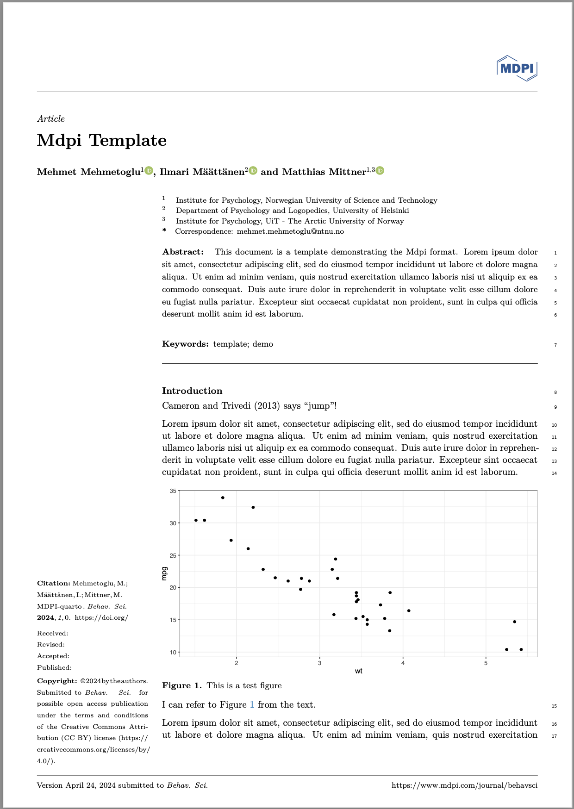

# Quarto template for MDPI journals




This Quarto template is based on the original MDPI LaTeX template: <https://www.mdpi.com/authors/latex>

## Creating a New Article

To create a new article using this format:

```bash
quarto use template ihrke/mdpi
```

This will create a new directory with an example document that uses this format.

## Using with an Existing Document

To add this format to an existing document:

```bash
quarto add https://github.com/ihrke/mdpi
```

Then, add the format to your document options:

```yaml
format:
  mdpi-pdf: default
```    

## Options

All regular options are supported. In addition, the following options are available:

- `article_status`: one of "submit", "accepted"
- `article_type`: one of abstract, addendum, article, book, bookreview, briefreport, casereport, comment, commentary, communication, conferenceproceedings, correction, conferencereport, entry, expressionofconcern, extendedabstract, datadescriptor, editorial, essay, erratum, hypothesis, interestingimage, obituary, opinion, projectreport, reply, retraction, review, perspective, protocol, shortnote, studyprotocol, systematicreview, supfile, technicalnote, viewpoint, guidelines, registeredreport, tutorial
- `mdpi_journal`: One of the acoustics, actuators, addictions, admsci, adolescents, aerobiology, aerospace, agriculture, agriengineering, agrochemicals, agronomy, ai, air, algorithms, allergies, alloys, analytica, analytics, anatomia, animals, antibiotics, antibodies, antioxidants, applbiosci, appliedchem, appliedmath, applmech, applmicrobiol, applnano, applsci, aquacj, architecture, arm, arthropoda, arts, asc, asi, astronomy, atmosphere, atoms, audiolres, automation, axioms, bacteria, batteries, bdcc, behavsci, beverages, biochem, bioengineering, biologics, biology, biomass, biomechanics, biomed, biomedicines, biomedinformatics, biomimetics, biomolecules, biophysica, biosensors, biotech, birds, bloods, blsf, brainsci, breath, buildings, businesses, cancers, carbon, cardiogenetics, catalysts, cells, ceramics, challenges, chemengineering, chemistry, chemosensors, chemproc, children, chips, cimb, civileng, cleantechnol, climate, clinpract, clockssleep, cmd, coasts, coatings, colloids, colorants, commodities, compounds, computation, computers, condensedmatter, conservation, constrmater, cosmetics, covid, crops, cryptography, crystals, csmf, ctn, curroncol, cyber, dairy, data, ddc, dentistry, dermato, dermatopathology, designs, devices, diabetology, diagnostics, dietetics, digital, disabilities, diseases, diversity, dna, drones, dynamics, earth, ebj, ecologies, econometrics, economies, education, ejihpe, electricity, electrochem, electronicmat, electronics, encyclopedia, endocrines, energies, eng, engproc, entomology, entropy, environments, environsciproc, epidemiologia, epigenomes, est, fermentation, fibers, fintech, fire, fishes, fluids, foods, forecasting, forensicsci, forests, foundations, fractalfract, fuels, future, futureinternet, futurepharmacol, futurephys, futuretransp, galaxies, games, gases, gastroent, gastrointestdisord, gels, genealogy, genes, geographies, geohazards, geomatics, geosciences, geotechnics, geriatrics, grasses, gucdd, hazardousmatters, healthcare, hearts, hemato, hematolrep, heritage, higheredu, highthroughput, histories, horticulturae, hospitals, humanities, humans, hydrobiology, hydrogen, hydrology, hygiene, idr, ijerph, ijfs, ijgi, ijms, ijns, ijpb, ijtm, ijtpp, ime, immuno, informatics, information, infrastructures, inorganics, insects, instruments, inventions, iot, j, jal, jcdd, jcm, jcp, jcs, jcto, jdb, jeta, jfb, jfmk, jimaging, jintelligence, jlpea, jmmp, jmp, jmse, jne, jnt, jof, joitmc, jor, journalmedia, jox, jpm, jrfm, jsan, jtaer, jvd, jzbg, kidneydial, kinasesphosphatases, knowledge, land, languages, laws, life, liquids, literature, livers, logics, logistics, lubricants, lymphatics, machines, macromol, magnetism, magnetochemistry, make, marinedrugs, materials, materproc, mathematics, mca, measurements, medicina, medicines, medsci, membranes, merits, metabolites, metals, meteorology, methane, metrology, micro, microarrays, microbiolres, micromachines, microorganisms, microplastics, minerals, mining, modelling, molbank, molecules, mps, msf, mti, muscles, nanoenergyadv, nanomanufacturing,nanomaterials, ncrna, ndt, network, neuroglia, neurolint, neurosci, nitrogen, notspecified, nursrep, nutraceuticals, nutrients, obesities, oceans, ohbm, onco, %oncopathology, optics, oral, organics, organoids, osteology, oxygen, parasites, parasitologia, particles, pathogens, pathophysiology, pediatrrep, pharmaceuticals, pharmaceutics, pharmacoepidemiology, pharmacy, philosophies, photochem, photonics, phycology, physchem, physics, physiologia, plants, plasma, platforms, pollutants, polymers, polysaccharides, poultry, powders, preprints, proceedings, processes, prosthesis, proteomes, psf, psych, psychiatryint, psychoactives, publications, quantumrep, quaternary, qubs, radiation, reactions, receptors, recycling, regeneration, religions, remotesensing, reports, reprodmed, resources, rheumato, risks, robotics, ruminants, safety, sci, scipharm, sclerosis, seeds, sensors, separations, sexes, signals, sinusitis, skins, smartcities, sna, societies, socsci, software, soilsystems, solar, solids, spectroscj, sports, standards, stats, std, stresses, surfaces, surgeries, suschem, sustainability, symmetry, synbio, systems, targets, taxonomy, technologies, telecom, test, textiles, thalassrep, thermo, tomography, tourismhosp, toxics, toxins, transplantology, transportation, traumacare, traumas, tropicalmed, universe, urbansci, uro, vaccines, vehicles, venereology, vetsci, vibration, virtualworlds, viruses, vision, waste, water, wem, wevj, wind, women, world, youth, zoonoticdis
- `fundingstatement`: a string with the funding statement
- `institutionalreview`: a string with the institutional review statement
- `informedconsent`: a string with the informed consent statement
- `dataavailability`: a string with the data availability statement
- `acknowledgements`: a string with the acknowledgements
- `conflictsofinterest`: a string with the conflicts of interest statement

## Example

Here is the source code for a minimal sample document: [template.qmd](template.qmd).

And here is the rendered PDF file: [template.pdf](template.pdf).


## Development notes

I took the template from here: <https://www.mdpi.com/authors/latex> on April, 23rd 2024.

If I ever need to update this, I had to made changes to the `mdpi.cls` file:

  - removed "Definitions/" from most paths (it expects the resource files to live there, but Quarto moves everything to the root)
  - I removed loading of the `hyperref` package as this is loaded by default and would cause clashes
    - I changed the default template (downloaded the standard Quarto template and adapted it) by adding all the `hyperref` commands given in the `mdpi.cls` file to it. That way, we preserve those settings.
  - I had to change the path to the logo files (I put them into "pics/" under the main directory)

